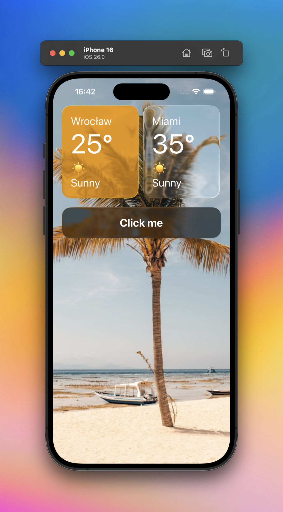

<div align="center">
  <h1>React Native Liquid Glass 🔍</h1>

[](https://github.com/callstack/liquid-glass/blob/main/LICENSE)
[](https://www.npmjs.org/package/@callstack/liquid-glass)

`@callstack/liquid-glass` brings iOS 26 liquid glass effect to React Native apps on iOS.


</div>

## Features

- ✨ iOS 26 liquid glass visual effect
- 🎨 Customizable tint colors
- 🔧 Two effect modes: `clear` and `regular`

## Documentation

### Installation

```bash
npm install @callstack/liquid-glass
# or
yarn add @callstack/liquid-glass
```

> [!WARNING]
> Make sure to compile your app with Xcode >= 26.

### Usage

```tsx
import { LiquidGlassView } from '@callstack/liquid-glass';

// Handle fallback for unsupported iOS versions
const supportsLiquidGlass =
  Platform.OS === 'ios' && Number(Platform.Version.split('.').at(0)) >= 26;

function MyComponent() {
  return (
    <LiquidGlassView
      style={[
        { width: 200, height: 100, borderRadius: 20 },
        !supportsLiquidGlass && { backgroundColor: 'rgba(255,255,255,0.5)' },
      ]}
      interactive
      effect="clear"
    >
      <Text>Hello World</Text>
    </LiquidGlassView>
  );
}
```

> [!NOTE]
> On unsupported iOS version (below iOS 26), it will render a normal `View` without any effects.

### LiquidGlassView - Props

| Prop          | Type                            | Default     | Description                                                                                                                         |
| ------------- | ------------------------------- | ----------- | ----------------------------------------------------------------------------------------------------------------------------------- |
| `interactive` | `boolean`                       | `false`     | Enables touch interaction effects when pressing the view                                                                            |
| `effect`      | `'clear' \| 'regular'`          | `'regular'` | Visual effect mode:<br/>• `clear` - More transparent glass effect<br/>• `regular` - Standard glass blur effect                      |
| `tintColor`   | `ColorValue`                    | `undefined` | Overlay color tint applied to the glass effect. Accepts any React Native color format (hex, rgba, named colors)                     |
| `colorScheme` | `'light' \| 'dark' \| 'system'` | `'system'`  | Color scheme adaptation:<br/>• `light` - Light appearance<br/>• `dark` - Dark appearance<br/>• `system` - Follows system appearance |

## Known issues

- `interactive` prop is not changed dynamically, it is only set on mount.

## Made with ❤️ at Callstack

`liquid-glass` is an open source project and will always remain free to use. If you think it's cool, please star it 🌟.

[Callstack][callstack-readme-with-love] is a group of React and React Native geeks, contact us at [hello@callstack.com](mailto:hello@callstack.com) if you need any help with these or just want to say hi!

Like the project? ⚛️ [Join the team](https://callstack.com/careers/?utm_campaign=Senior_RN&utm_source=github&utm_medium=readme) who does amazing stuff for clients and drives React Native Open Source! 🔥

[callstack-readme-with-love]: https://callstack.com/?utm_source=github.com&utm_medium=referral&utm_campaign=liquid-glass&utm_term=readme-with-love
[version-badge]: https://img.shields.io/npm/v/@callstack/liquid-glass?style=for-the-badge
[version]: https://github.com/callstack/liquid-glass/blob/main/LICENSE
[prs-welcome-badge]: https://img.shields.io/badge/PRs-welcome-brightgreen.svg?style=for-the-badge
[prs-welcome]: ./CONTRIBUTING.md
